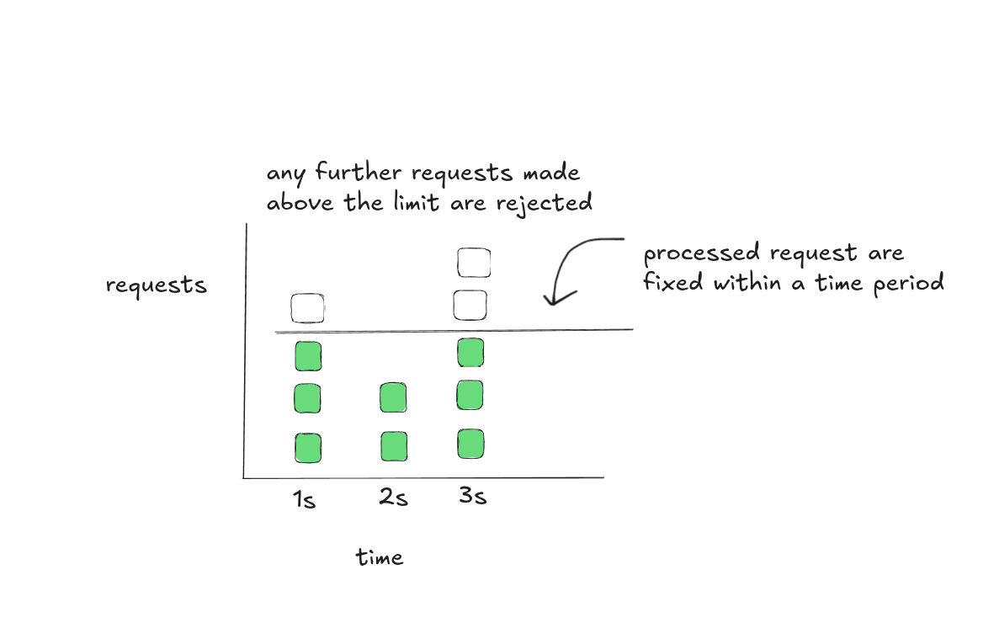

# Fixed-Window Counter Algorithm

The fixed-window counter is one of the simplest rate limiting strategies.

### How It Works

- Time is split into fixed-size windows (e.g. 1 min).
- A counter tracks how many requests have been handled in the current window.
- Once the counter reaches the maximum, all subsequent requests are rejected until a new time window starts.
- At the exact boundary of the next window, the counter resets to zero.
---

### Diagram




### Key Characteristics

- It handles bursts only up to the limit within the current window.
- This can lead to bursty traffic spikes at the exact time the new window starts making all the rejected requests become valid at that instant of time.
- **Latency:** The algorithm adds a minimal amount of processing latency to each request, making it very fast.

---

#### Pros

- It is memory efficient as it only requires a single counter per time window.
- Easy to understand and implement.

#### Cons

- There could probably be a boundary spike problem which his is the significant drawback. A burst of requests at the very end of one window, followed by another burst at the beginning of the next, can effectively allow double the intended rate within a short period.
- Spike in traffic at the edges of a window could cause more requests than the allowed quota to go through.


---

## Environment Setup

Required environment variables:

| Variable       | Description                                |
| -------------- | ------------------------------------------ |
| `PORT`         | HTTP server port                           |
| `WINDOW_SIZE`  | Duration of each fixed window (e.g. `10s`) |
| `MAX_REQUESTS` | Maximum requests allowed **per window**    |

### With Docker Compose

```bash
docker compose up --build
```

### Or run locally

```bash
PORT=8080 WINDOW_SIZE=10s MAX_REQUESTS=5 go run .
```

---

### Prometheus Configuration

Save as `prometheus.yml`:

```yaml
global:
  scrape_interval: 10s
  evaluation_interval: 10s

scrape_configs:
  - job_name: "fixed-window-counter"
    static_configs:
      - targets: ["api:yourport"]
    metrics_path: /metrics
    honor_timestamps: true
```

---

### Grafana Dashboard

Import [grafana.json](https://www.google.com/search?q=./grafana.json) for a go-to dashboard.

---

## Testing Endpoints

### 1\. API Request Endpoint

```bash
curl http://localhost:8080/api/request
```

- **HTTP 200 OK** – request counted in the current window.
- **HTTP 429 Too Many Requests** – limit reached for this window.

### 2\. Prometheus Metrics Endpoint

```bash
curl http://localhost:8080/metrics
```

Key metrics exposed:

| Metric Name                                    | Meaning                                            |
| ---------------------------------------------- | -------------------------------------------------- |
| `fixed_window_requests_processed_total`        | Requests accepted so far in all windows            |
| `fixed_window_requests_rejected_total`         | Requests rejected because the window was full      |
| `fixed_window_current_requests`                | Requests already counted in the **current** window |
| `fixed_window_max_requests`                    | Configured limit per window                        |
| `fixed_window_time_until_reset_seconds`        | Seconds until the current window resets            |
| `fixed_window_request_duration_seconds_bucket` | Histogram of decision latency                      |


⚠️ Note  
This is just my understanding and attempt at implementing the concept and diagram(which was made by me).  
If something’s off in the implementation — well, that’s part of the learning journey 🚀
