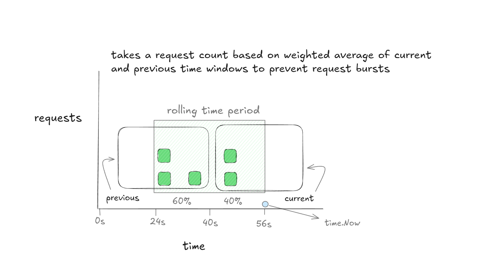

# Sliding-Window-Log Algorithm

The **sliding window log** algorithm is a precise rate limiting technique that stores timestamps of incoming requests and allows or denies them based on activity within a moving time window.

### How It Works

- Every accepted request is logged with its arrival timestamp in an internal deque.
- On each Allow() call the algorithm slides the window by removing the timestamps older than windowSize.
- The remaining log size is the exact number of requests seen in the last windowSize interval.
- A request is allowed only if **currentLogSize + n ≤ maxRequests**.

**Important to Note**: Unlike the sliding-window counter, this algorithm maintains an exact count of requests by logging every event. This provides perfect precision and completely eliminates the boundary spike problem, but at the cost of higher memory consumption.

---
### Diagram


---

### Pros & Cons

#### Pros

- This algorithm provides accurate count of requests within the sliding interval which is important for strict rate-limiting.
- Solves the boundary-spike issue that encounters in teh fixed-window counter as it's based on the timestamps.

#### Cons

- This is the significant drawback - Memory usage grows with traffic and the **maxRequests** limit as every request's timestamp must be stored. For high-volume systems, this can be a major issue.
- It requires more CPU cycles to manage the deque, including inserting new timestamps and removing old ones on every request.


---

## Environment Setup

Required environment variables:

| Variable       | Description                                            |
| -------------- | ------------------------------------------------------ |
| `PORT`         | HTTP server port                                       |
| `WINDOW_SIZE`  | Duration of the sliding window (e.g. **60s**)      |
| `MAX_REQUESTS` | Maximum requests allowed within any rolling window |

### With Docker Compose

```bash
docker compose up --build
```

### Or run locally

```bash
PORT=8080 WINDOW_SIZE=60s MAX_REQUESTS=20 go run .
```

---

### Prometheus Configuration

Save as `prometheus.yml`:

```yaml
global:
  scrape_interval: 10s
  evaluation_interval: 10s

scrape_configs:
  - job_name: "sliding-window-log"
    static_configs:
      - targets: ["api:yourport"]
    metrics_path: /metrics
    honor_timestamps: true
```

---

### Grafana Dashboard

Import [grafana.json](https://www.google.com/search?q=./grafana.json) for a ready-made dashboard.

### Demo Output


---

## Testing Endpoints

### 1\. API Request Endpoint

```bash
curl http://localhost:8080/api/request
```

- **HTTP 200 OK** – request logged and allowed.
- **HTTP 429 Too Many Requests** – log already contains `MAX_REQUESTS` within the last `WINDOW_SIZE`.

### 2\. Load Testing with `vegeta`

Start hammering the endpoint and watch the real-time metrics and rolling count on the Grafana dashboard.

```bash
echo "GET http://localhost:8080/" | vegeta attack -rate=50 -duration=30s | vegeta report
```

### 3\. Prometheus Metrics Endpoint

```bash
curl http://localhost:8080/metrics
```

Key metrics exposed:

| Metric Name                                   | Meaning                                      |
| --------------------------------------------- | -------------------------------------------- |
| `sliding_window_log_requests_processed_total` | Requests accepted in total                   |
| `sliding_window_log_requests_rejected_total`  | Requests rejected in total                   |
| `sliding_window_log_current_count`            | Number of requests inside the rolling window |
| `sliding_window_log_max_requests`             | Limit per window                             |
| `sliding_window_log_window_size_seconds`      | Window size duration                         |

⚠️ Note  
This is just my understanding and attempt at implementing the concept and diagram(which was made by me).  
If something’s off in the implementation — well, that’s part of the learning journey 🚀
